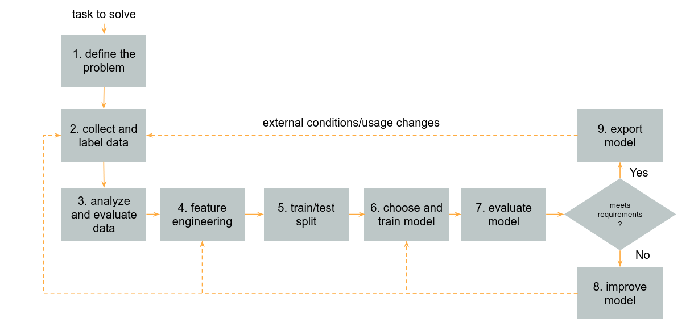

# ml-in-php-start-templates
This project is supposed to be a starting template for replacing business logic in PHP projects with machine learning models. 
I add here common use cases of how to use machine learning models in PHP projects.
In order to use it in your projects you need to replace the data with your dataset and adjust data import and feature engineering stages. 

Examples cover 4 use cases:

### 1. Regression model train and use as micorservice

   *Predict car sale prices based on archive results.*

   Python + Scikit-Learn + Flask + Gunicorn + Nginx

   setup containers:

   `cd python-docker-regression &&  docker-compose -f docker-compose.yml up -d --build`

   request API GET:

   `http://127.0.0.1:1338/?data=[[22.0, 7.2500, 0, 1, 0, 3, 2.0]]`

### 2. Classification model train and use as micorservice

   *Classify user agent into indexing bots and others.*

   Python + Scikit-Learn + Flask + Gunicorn + Nginx

   setup containers:

   `cd python-docker-classify &&  docker-compose -f docker-compose.yml up -d --build`

   request API GET:

   `http://127.0.0.1:1337/?data=Googlebot-Image/1.0`

### 3. Prognose sales from time series

   *Prognose sales for future dates based on sales from the past.*

   PHP + Rindow Neural Networks

   To train and test model run:

   `bin/cli prognose-sales-nn-pipeline`

   or using docker:

   `docker run --rm rzarno/ml-in-php-start-templates prognose-sales-nn-pipeline`

### 4. Recognize captcha images

   *Recognize characters on captcha images using convolutional neural networks*

   PHP + Rindow Neural Networks + Nvidia DAVE-2 CNN model architecture

   To train and test model run:

   `bin/cli captcha-image-classification-cnn-pipeline`

   or using docker:

   `docker run --rm rzarno/ml-in-php-start-templates captcha-image-classification-cnn-pipeline`

### Machine learning process
Machine learning process is a universal sequence of action that you need to perform on your data in order to build prediction model.
Each stage of chain can be represented as a separate class, for example: load data, split to train and test set, ...
For implementation chain of responsibility pattern was used. Find below diagram showing whole process:

